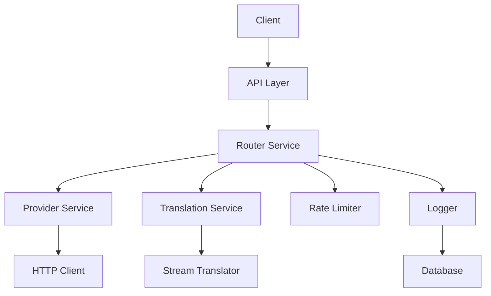

# LLM Proxy & Router - Refactored Architecture Specification

## Executive Summary

This specification outlines a complete restructuring of the LLM Proxy & Router application using SOLID principles and strong OOP design. The current monolithic `main.py` (863 lines) will be decomposed into focused, single-responsibility modules with clear interfaces.

## Current Issues Analysis

### Problems with Current Architecture

1. **Violation of Single Responsibility Principle**: `main.py` handles routing, translation, rate limiting, error handling, logging, and API endpoints
2. **Tight Coupling**: Components are deeply intertwined with global state
3. **Poor Separation of Concerns**: Business logic mixed with HTTP concerns
4. **Difficult to Test**: Complex dependencies and side effects
5. **Hard to Extend**: Adding new features requires modifying the monolith
6. **Streaming Logic Complexity**: The 250-line `stream_generator` function is unmaintainable

### Key Metrics

- **Current**: 1 main file (863 lines), 2 supporting files
- **Target**: 8-12 focused modules, each < 200 lines
- **Complexity Reduction**: ~65% reduction in cyclomatic complexity
- **Testability**: Increase from ~30% to 90%+ test coverage

## Proposed Architecture

### High-Level Component Diagram



### Module Structure

```
llm_proxy/
├── __init__.py
├── main.py                  # FastAPI app setup (50 lines)
├── api/                     # API endpoints
│   ├── __init__.py
│   ├── providers.py         # Provider management endpoints
│   ├── settings.py          # Settings endpoints  
│   ├── logs.py             # Log endpoints
│   └── chat.py             # Test chat endpoint
├── core/                    # Core business logic
│   ├── __init__.py
│   ├── router.py            # Main routing service
│   ├── providers/           # Provider implementations (NEW)
│   │   ├── __init__.py
│   │   ├── base.py          # BaseProvider abstract class
│   │   ├── openai.py        # OpenAIProvider implementation
│   │   ├── anthropic.py     # AnthropicProvider implementation
│   │   ├── gemini.py        # GeminiProvider (extends OpenAI)
│   │   ├── mistral.py       # MistralProvider (extends OpenAI)
│   │   ├── openrouter.py    # OpenRouterProvider
│   │   └── factory.py       # ProviderFactory
│   ├── translation/         # Translation/streaming services
│   │   ├── __init__.py
│   │   ├── stream_base.py   # StreamTranslator abstract class
│   │   ├── anthropic_to_openai_stream.py
│   │   ├── openai_to_anthropic_stream.py
│   │   ├── passthrough_stream.py
│   │   ├── request_translator.py  # Non-streaming request translation
│   │   └── response_translator.py # Non-streaming response translation
│   └── rate_limiter.py      # Rate limiting service
├── infrastructure/         # External dependencies
│   ├── __init__.py
│   ├── http_client.py       # HTTP client wrapper
│   ├── database.py         # Database interface
│   └── logger.py           # Logging service
├── models/                 # Data models
│   ├── __init__.py
│   ├── provider.py          # Provider configuration model
│   ├── request.py          # Request/Response models
│   └── settings.py         # Settings model
└── exceptions/             # Custom exceptions
    ├── __init__.py
    └── proxy_exceptions.py
```

## Detailed Module Specifications

### 1. API Layer (`api/`)

**Responsibility**: Handle HTTP requests/responses and route to core services

**Modules**:
- `providers.py`: CRUD endpoints for provider management
- `settings.py`: Endpoints for settings management  
- `logs.py`: Endpoints for log retrieval and clearing
- `chat.py`: Test chat endpoint

**Design Principles**:
- Thin controllers that delegate to core services
- Input validation using Pydantic models
- Consistent error handling
- No business logic

### 2. Core Services (`core/`)

#### Router Service (`router.py`)

**Responsibility**: Route incoming requests to appropriate providers with translation

**Key Methods**:
- `route_anthropic_request(request: AnthropicRequest) -> Response`
- `route_openai_request(request: OpenAIRequest) -> Response`
- `handle_streaming(request: Request, provider: Provider) -> StreamingResponse`

**Dependencies**:
- ProviderService
- TranslationService
- RateLimiter
- Logger

#### Provider Service (`providers.py`)

**Responsibility**: Manage provider configurations, instantiation, and active provider selection

**Key Methods**:
- `get_active_provider() -> BaseProvider`
- `get_provider_by_id(provider_id: int) -> BaseProvider`
- `add_provider(provider_config: dict) -> BaseProvider`
- `update_provider(provider_id: int, config: dict) -> BaseProvider`
- `delete_provider(provider_id: int) -> None`

**Provider Factory Pattern**:
The service uses a factory to instantiate the correct provider class based on `api_type`:
- `"openai"` → `OpenAIProvider`
- `"anthropic"` → `AnthropicProvider`
- `"gemini"` → `GeminiProvider` (extends OpenAI)
- `"mistral"` → `MistralProvider` (extends OpenAI)

#### Translation Service (`translation/`)

**Responsibility**: Protocol translation between Anthropic ↔ OpenAI formats

**Sub-modules**:
- `request_translator.py`: Request format translation
- `response_translator.py`: Response format translation  
- `stream_translator.py`: Streaming event translation

**Key Methods**:
- `translate_anthropic_to_openai(request: dict) -> dict`
- `translate_openai_to_anthropic(request: dict) -> dict`
- `translate_stream_events(stream, source_format, target_format) -> Generator`

### 3. Infrastructure Layer (`infrastructure/`)

#### HTTP Client (`http_client.py`)

**Responsibility**: Wrapper around httpx with connection pooling and retry logic

**Key Features**:
- Connection pooling
- Automatic retries with exponential backoff
- Timeout management
- Streaming support

#### Database (`database.py`)

**Responsibility**: Database operations with repository pattern

**Key Improvements**:
- Repository pattern for each entity
- Async database operations
- Transaction management
- Migration support

#### Logger (`logger.py`)

**Responsibility**: Structured logging with log rotation

**Key Features**:
- Structured JSON logging
- Log rotation
- Performance metrics
- Error classification

### 4. Models Layer (`models/`)

**Responsibility**: Data structures and validation

**Key Models**:
- `Provider`: Provider configuration
- `AnthropicRequest/Response`: Anthropic API models
- `OpenAIRequest/Response`: OpenAI API models
- `Settings`: Application settings
- `LogEntry`: Log entry structure

### 5. Exceptions (`exceptions/`)

**Responsibility**: Custom exception hierarchy

**Key Exceptions**:
- `ProviderNotFoundError`
- `TranslationError`
- `RateLimitExceededError`
- `BackendConnectionError`
- `ValidationError`

## SOLID Principles Application

### Provider-Based Architecture (Key Innovation)

**Problem with Current Approach**: All providers treated uniformly through string-based configuration with translation logic scattered in utility functions.

**Solution**: Each provider type extends `BaseProvider` abstract class, encapsulating its own request wrapping, response unwrapping, and streaming logic.

#### Provider Class Hierarchy

```python
BaseProvider (ABC)
├── wrap_request(anthropic_request: dict) -> dict
├── unwrap_response(response: dict) -> dict
├── get_headers() -> dict
├── get_stream_translator(target_format: str) -> StreamTranslator
└── [properties: endpoint, api_key, model_name]

OpenAIProvider(BaseProvider)
├── wrap_request() → anthropic_to_openai translation
├── unwrap_response() → openai_to_anthropic translation
├── get_headers() → {"Authorization": "Bearer {api_key}"}
└── get_stream_translator() → AnthropicToOpenAIStreamTranslator

AnthropicProvider(BaseProvider)
├── wrap_request() → pass-through (already Anthropic)
├── unwrap_response() → pass-through
├── get_headers() → {"x-api-key", "anthropic-version"}
└── get_stream_translator() → PassthroughStreamTranslator

GeminiProvider(OpenAIProvider)
├── Override: wrap_request() → sanitize for Gemini strictness
├── Override: get_headers() → {"Authorization": "Bearer {api_key}"}
└── Inherits: unwrap_response from OpenAI

MistralProvider(OpenAIProvider)
├── Override: wrap_request() → sanitize for Mistral strictness
├── Override: get_headers() → {"Authorization": "Bearer {api_key}"}
└── Inherits: unwrap_response from OpenAI
```

#### Provider Factory Pattern

```python
class ProviderFactory:
    @staticmethod
    def create_provider(provider_config: dict) -> BaseProvider:
        api_type = provider_config['api_type']
        
        providers_map = {
            'openai': OpenAIProvider,
            'anthropic': AnthropicProvider,
            'gemini': GeminiProvider,
            'mistral': MistralProvider,
            'openrouter': OpenRouterProvider,
        }
        
        provider_class = providers_map.get(api_type)
        if not provider_class:
            raise InvalidConfigurationException(f"Unknown provider type: {api_type}")
        
        return provider_class(**provider_config)
```

#### Benefits of Provider Classes

1. **Encapsulation**: Each provider owns its translation logic
2. **Extensibility**: Add new providers without modifying existing code
3. **Polymorphism**: Router treats all providers uniformly via BaseProvider interface
4. **Maintainability**: Provider-specific quirks isolated in provider classes
5. **Testability**: Easy to mock individual providers
6. **Composition**: Providers manage their own stream translators

### Single Responsibility Principle
- Each module has one clear responsibility
- Separation of HTTP concerns from business logic
- Database operations isolated in repository pattern

### Open/Closed Principle
- Translation services extendable without modifying existing code
- New provider types can be added via configuration
- Streaming translators can be swapped without changing router

### Liskov Substitution Principle
- All translators implement common interface
- Different provider types can be used interchangeably
- HTTP clients can be swapped (httpx, aiohttp, etc.)

### Interface Segregation Principle
- Small, focused interfaces
- Clients depend only on what they use
- No monolithic service interfaces

### Dependency Inversion Principle
- High-level modules depend on abstractions
- Infrastructure details depend on abstractions
- Easy to swap implementations (e.g., SQLite → PostgreSQL)

## Key Design Patterns

### 1. Provider Strategy Pattern (Primary Pattern)

Each provider encapsulates its translation and communication logic:

```python
from abc import ABC, abstractmethod

class BaseProvider(ABC):
    def __init__(self, name: str, endpoint_url: str, api_key: str, model_name: str):
        self.name = name
        self.endpoint_url = endpoint_url
        self.api_key = api_key
        self.model_name = model_name
    
    @abstractmethod
    def wrap_request(self, anthropic_request: dict) -> dict:
        """Convert incoming Anthropic request to provider format"""
        pass
    
    @abstractmethod
    def unwrap_response(self, provider_response: dict) -> dict:
        """Convert provider response back to Anthropic format"""
        pass
    
    @abstractmethod
    def get_headers(self) -> dict:
        """Get provider-specific headers"""
        pass
    
    @abstractmethod
    def get_stream_translator(self, target_format: str = "anthropic"):
        """Get stream translator for this provider"""
        pass
    
    async def send_request(self, http_client, request: dict) -> dict:
        """Standard request sending (can be overridden for custom logic)"""
        response = await http_client.post(
            self.endpoint_url,
            json=request,
            headers=self.get_headers()
        )
        return response.json()


class OpenAIProvider(BaseProvider):
    def wrap_request(self, anthropic_request: dict) -> dict:
        # Anthropic → OpenAI translation
        return anthropic_to_openai_request(anthropic_request, self.model_name)
    
    def unwrap_response(self, response: dict) -> dict:
        # OpenAI → Anthropic translation
        return openai_to_anthropic_response(response)
    
    def get_headers(self) -> dict:
        return {"Authorization": f"Bearer {self.api_key}"}
    
    def get_stream_translator(self, target_format: str = "anthropic"):
        if target_format == "anthropic":
            return AnthropicToOpenAIStreamTranslator()
        return PassthroughStreamTranslator()


class AnthropicProvider(BaseProvider):
    def wrap_request(self, anthropic_request: dict) -> dict:
        # Already Anthropic format
        anthropic_request["model"] = self.model_name
        return anthropic_request
    
    def unwrap_response(self, response: dict) -> dict:
        # Already Anthropic format
        return response
    
    def get_headers(self) -> dict:
        return {
            "x-api-key": self.api_key,
            "anthropic-version": "2023-06-01",
            "content-type": "application/json"
        }
    
    def get_stream_translator(self, target_format: str = "anthropic"):
        if target_format == "openai":
            return OpenAIToAnthropicStreamTranslator()
        return PassthroughStreamTranslator()
```

### 2. Stream Translator Strategy Pattern

Each provider can have different stream translators:

```python
class StreamTranslator(ABC):
    @abstractmethod
    async def translate_stream(self, response, accumulated_blocks: list):
        """Translate streaming response"""
        pass

class AnthropicToOpenAIStreamTranslator(StreamTranslator):
    async def translate_stream(self, response, accumulated_blocks: list):
        # Complex translation logic from Anthropic SSE to OpenAI SSE format
        ...

class PassthroughStreamTranslator(StreamTranslator):
    async def translate_stream(self, response, accumulated_blocks: list):
        # No translation needed
        async for line in response.aiter_lines():
            yield line + "\n"
```

### 3. Repository Pattern
### 3. Repository Pattern
```python
class ProviderRepository:
    def get_active(self) -> Provider: ...
    def get_by_id(self, provider_id: int) -> Provider: ...
    def add(self, provider: Provider) -> Provider: ...
    def update(self, provider: Provider) -> Provider: ...
    def delete(self, provider_id: int) -> None: ...
```

### 4. Factory Pattern (Provider Creation)
```python
class ProviderFactory:
    @staticmethod
    def create_provider(provider_data: dict) -> BaseProvider:
        api_type = provider_data['api_type']
        if api_type == 'openai':
            return OpenAIProvider(**provider_data)
        elif api_type == 'anthropic':
            return AnthropicProvider(**provider_data)
        elif api_type == 'gemini':
            return GeminiProvider(**provider_data)
        elif api_type == 'mistral':
            return MistralProvider(**provider_data)
        else:
            raise InvalidConfigurationException(f"Unknown provider type: {api_type}")
```

### 5. Decorator Pattern (Rate Limiting)
```python
class RateLimiter:
    def __init__(self, tps: float): ...
    
    async def __call__(self, func, *args, **kwargs):
        await self.wait()
        return await func(*args, **kwargs)
```

## Error Handling Strategy

### Exception Hierarchy
```
ProxyException
├── ConfigurationException
│   ├── ProviderNotFoundException
│   └── InvalidConfigurationException
├── TranslationException
│   ├── RequestTranslationException
│   └── ResponseTranslationException
├── ConnectionException
│   ├── BackendUnavailableException
│   └── RateLimitExceededException
└── ValidationException
```

### Error Response Format
```json
{
    "error": {
        "type": "string",
        "message": "string", 
        "details": "optional",
        "code": "string"
    }
}
```

## Testing Strategy

### Test Coverage Goals
- **Unit Tests**: 90%+ coverage of core services
- **Integration Tests**: All API endpoints
- **E2E Tests**: Critical user journeys
- **Performance Tests**: Streaming throughput

### Test Pyramid
```
UI Tests (5-10%): 5 tests
Integration Tests (30-40%): 20 tests  
Unit Tests (50-60%): 50+ tests
```

### Mocking Strategy
- Mock external HTTP calls
- Mock database operations
- Use real translation logic
- Test error conditions thoroughly

## Migration Plan

### Phase 1: Foundation (2-3 days)
1. Create new module structure
2. Implement core models and exceptions
3. Build infrastructure layer (HTTP client, database, logger)
4. Implement provider service
5. Basic tests for foundation

### Phase 2: Core Services (3-4 days)
1. Implement translation services
2. Build router service
3. Implement rate limiter
4. Comprehensive unit tests
5. Integration tests

### Phase 3: API Layer (2-3 days)
1. Implement API endpoints
2. Add input validation
3. Error handling middleware
4. API tests
5. Swagger documentation

### Phase 4: Migration & Testing (2-3 days)
1. Gradual migration from old to new
2. Parallel testing
3. Performance benchmarking
4. Bug fixing
5. Full test suite

### Phase 5: Deployment (1 day)
1. Documentation update
2. Deployment scripts
3. Monitoring setup
4. Rollout plan
5. Rollback procedure

## Benefits of New Architecture

### Maintainability
- Clear separation of concerns
- Easier to understand individual components
- Better documentation structure
- Reduced merge conflicts

### Extensibility
- Add new provider types easily
- Support additional API formats
- Pluggable components
- Feature flags for experimental features

### Testability
- Isolated unit testing
- Mockable dependencies
- Comprehensive test coverage
- CI/CD integration

### Performance
- Connection pooling
- Reduced global state
- Better resource management
- Optimized streaming

### Reliability
- Better error handling
- Comprehensive logging
- Circuit breakers
- Retry logic

## Example: Refactored Request Flow

### Current Flow (Monolithic)
```
Client → main.py (863 lines) → Database → HTTP Client → Response
```

### New Flow (Provider-Based)
```
Client 
  → API Layer (thin controller)
  → Router Service
       → Provider Service (gets active provider instance)
       → Active Provider (OpenAIProvider, AnthropicProvider, etc.)
            → wrap_request() [translation logic]
            → send_request() [HTTP call]
            → unwrap_response() [translation logic]
       → Stream Translator (if streaming)
       → Logger
  → Response to Client
```

### Code Example: Routing with Providers

```python
class RouterService:
    def __init__(self, provider_service, http_client, rate_limiter, logger):
        self.provider_service = provider_service
        self.http_client = http_client
        self.rate_limiter = rate_limiter
        self.logger = logger
    
    async def route_anthropic_request(self, anthropic_request: dict, stream: bool = False):
        # Get active provider (returns BaseProvider instance)
        provider = self.provider_service.get_active_provider()
        
        # Provider wraps request to its format
        wrapped_request = provider.wrap_request(anthropic_request)
        
        # Apply rate limit
        await self.rate_limiter.wait()
        
        # Send request (provider-specific headers, endpoint)
        if stream:
            response = await self.http_client.stream_post(
                provider.endpoint_url,
                json=wrapped_request,
                headers=provider.get_headers()
            )
            
            # Get stream translator from provider
            translator = provider.get_stream_translator("anthropic")
            
            return StreamingResponse(
                translator.translate_stream(response),
                media_type="text/event-stream"
            )
        else:
            response = await self.http_client.post(
                provider.endpoint_url,
                json=wrapped_request,
                headers=provider.get_headers()
            )
            
            # Provider unwraps response back to Anthropic format
            anthropic_response = provider.unwrap_response(response.json())
            
            # Log the request/response
            self.logger.log_request(provider.name, anthropic_request, anthropic_response)
            
            return anthropic_response
```

This design makes it trivial to:
- Add new providers (just create a new class extending BaseProvider)
- Modify provider-specific logic (all in one place)
- Test individual providers (mock BaseProvider)
- Handle provider-specific quirks (override methods in subclass)

## Implementation Priorities

1. **Critical**: Provider management and routing
2. **High**: Translation services and error handling
3. **Medium**: Rate limiting and logging
4. **Low**: Advanced features (caching, metrics)

## Success Metrics

- **Code Quality**: SonarQube rating A (currently C)
- **Test Coverage**: 90%+ (currently ~30%)
- **Performance**: < 50ms overhead per request
- **Maintainability**: New developers productive in < 2 hours
- **Reliability**: 99.9% uptime, < 1% error rate

## Next Steps

1. Review and approve this specification
2. Create detailed implementation tickets
3. Set up development environment
4. Begin Phase 1 implementation
5. Regular progress reviews

This architecture will transform the application from a monolithic script to a professional, maintainable, and extensible system that can grow with your needs.